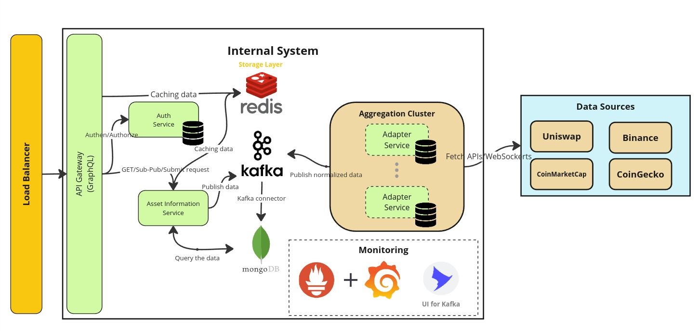

# The Oracle System Architecture



## **Overview of the Oracle System Architecture**

This architecture consists of multiple integrated components designed to retrieve, aggregate, and deliver real-time cryptocurrency prices from various decentralized and centralized exchanges as well as aggregator services. The system ensures high performance and scalability to support multiple clients with diverse asset requirements.

### **Key Components**

- **Load Balancer**
  - Distributes incoming client requests evenly across the internal services to ensure system availability and reliability under high traffic conditions.

- **API Gateway (GraphQL)**
  - The main interface through which clients interact with the oracle system. It facilitates querying cryptocurrency prices, submitting data, and managing subscriptions for real-time updates. GraphQL allows clients to specify exactly what data they need, reducing response payload size and improving efficiency.

- **Auth Service**
  - Manages client authentication and authorization, ensuring only authorized clients can query or submit price data. This adds a layer of security and restricts access to valid users. This service has their own database to store vital informations.

- **Asset Information Service**
  - This service handles requests from the API gateway, managing queries, subscriptions (Pub-Sub), and submission requests from clients. It interacts with both Redis for quick access to cached data and Kafka to handle the publishing data processing.

- **Redis**
  - Serves as the caching layer, where frequently accessed price data is stored to improve query speed. This ensures fast responses for clients, especially for real-time data requests.

- **Aggregation Cluster**
  - **Adapter Services** fetch and aggregate real-time price data from multiple sources such as Uniswap, Binance, CoinMarketCap, and CoinGecko. These services communicate with the external APIs or WebSockets of data sources to retrieve accurate price data.
  - The service can configure the external data source endpoints to support scalability.
  - The services keep fetching data from sources depended on chosen solution (schedule job, or keep alive the connection)
  - **Adapter Services** has access the cluster's database for record crucial information to use in the future, for instance collect data to calculate confidence score, which one has high reliability.
  - The normalized data is published to **Kafka**, which ensures the system's internal services, including the Asset Information Service and clients, are updated in real time.

- **Kafka**
  - Kafka is a critical component in ensuring real-time data distribution and system resilience. After data is aggregated by the Adapter Services, it is normalized and published through Kafka.
  - The **Kafka connector** also ensures seamless integration with MongoDB, allowing for historical data storage and event-driven interactions.

- **MongoDB**
  - Stores historical price data and client interactions, enabling the system to maintain records for audits, analytics, or regulatory compliance. MongoDB provides scalable storage for long-term data needs.

- **Monitoring (Prometheus, Grafana, and Kafka UI)**
  - Prometheus collects metrics from various system components (e.g., Kafka, Redis, API Gateway), while Grafana provides real-time dashboards and visualization of these metrics.
  - Kafka UI offers a user-friendly interface for monitoring Kafka topics, brokers, and consumers, ensuring operational transparency and facilitating troubleshooting.
  This monitoring stack ensures the system is operating smoothly, and issues can be identified and addressed promptly.

## **Mechanism for Query Real-Time Prices**

- **Client Interaction Flow**:
  1. **Authentication**: Clients authenticate via the **Auth Service** using an API key or OAuth token.
  2. **GraphQL Query**: The client sends a request to the API Gateway specifying the desired data (e.g., prices for specific cryptocurrencies).
  3. **Redis Cache Check**: The system first checks **Redis** to see if cached price data is available. If it is, the system returns it immediately to the client.
  4. **Data Fetching from storage**: If no cache is available, the **Asset Information Service** fetch data from **MongoDB**.
  5. **Data Delivery**: Normalized data is returned to the client in a structured format (e.g., JSON) through the GraphQL interface.

- **Example of a Query Response**:

  ```json
  {
    "symbol": "BTC",
    "price_usd": 60000,
    "timestamp": "2024-10-05T15:00:00Z",
    "source": "CoinGecko"
  }
  ```

---

## **Mechanism to Submit Cryptocurrency Prices**

- **Client Interaction Flow**:
  1. **Authentication**: Clients authenticate and submit cryptocurrency price data through the **API Gateway**.
  2. **Data Submission**: The **Asset Information Service** receives the data and passes it through Kafka to other services.
  3. **Validation and Storage**: Submitted price data is validated and stored in **MongoDB** for future use, which publishes the normalized price data to Kafka for distribution to subscribers or further processing by internal services.

- **Example of a Price Submission**:
  
  ```json
  {
    "symbol": "ETH",
    "price_usd": 4500,
    "timestamp": "2024-10-05T15:05:00Z",
    "submitted_by": "ClientX"
  }
  ```

---

## **Challenges in Data Accuracy and Consistency**

### **Data Source Reliability**

- **Challenge**: The external data sources (e.g., Binance, Uniswap, CoinMarketCap, etc.) might have some point that make the data to be inconsitency in terms of data accuracy and availability.
- **Solution**: Each **Adapter Service** will track the reliability of data sources by calculating a confidence score based on past performance (e.g., response time, data freshness, error rate). In cases where one source becomes unavailable or provides inconsistent data, the system will prioritize fetching data from more reliable sources. A failover mechanism can be implemented to ensure the system continues operating smoothly even if some data sources become temporarily unavailable.

### **Handling Latency**

- **Challenge**: The system needs to minimize latency in fetching and delivering cryptocurrency price data, especially for clients relying on real-time updates.
- **Solution**: **Redis** acts as a caching layer, storing frequently queried data to reduce latency. Redis helps avoid repeatedly fetching the same data from external sources unless absolutely necessary, ensuring that clients receive responses quickly.

---

## **Error Handling and Resilience Strategies**

### **Failover Mechanism for Data Sources**

- **Challenge**: Data sources may become temporarily unavailable due to network issues, service outages, or maintenance.
- **Solution**: Each **Adapter Service** will have a built-in failover mechanism. If an external data source (e.g., Uniswap or CoinMarketCap) becomes unavailable, the system will automatically switch to an alternative source. Additionally, **Redis** can serve cached data during the downtime, ensuring continued service to clients while the issue is resolved.

### **Error Handling in the Aggregation Cluster**

- **Challenge**: When fetching data from multiple external APIs, there is a possibility of receiving invalid or incomplete data.
- **Solution**: The **Adapter Services** will implement robust error-handling logic, such as retry mechanisms with exponential backoff. In cases where the data received is invalid, the system will log the error and attempt to re-fetch the data after a short delay. If an API continues to return invalid data, the system will temporarily blacklist that data source and use alternatives.

### **Kafka's Role in Ensuring Resilience**

- **Challenge**: To ensure reliable and real-time distribution of data across services and clients, even when there are failures in certain components.
- **Solution**: **Kafka** provides a highly available and durable messaging system that can buffer and distribute messages across multiple services. Kafka ensures that if one service or component (e.g., MongoDB) goes down, the data will be queued and safely distributed once the component is back online, ensuring no data loss. Kafka’s replication and partitioning features also ensure high availability of data streams.

### **Monitoring and Alerts**

- **Challenge**: Detecting system issues and preventing potential outages before they affect users.
- **Solution**: The system is equipped with a monitoring stack consisting of **Prometheus** and **Grafana**. Prometheus tracks key performance metrics such as API response times, Redis cache hit rates, Kafka message throughput, and overall system health. **Grafana** provides real-time dashboards for engineers to visualize these metrics. Alerts will be configured to notify administrators if key thresholds are breached (e.g., if a data source becomes unavailable or response times exceed acceptable limits). This ensures timely intervention before clients are impacted.

### **Data Consistency and Redundancy**

- **Challenge**: Ensuring data consistency between the cache (Redis), database (MongoDB), and the real-time data provided by external sources.
- **Solution**: The system employs multiple layers of data redundancy. **Redis** caches real-time data to serve fast responses, while **MongoDB** stores a historical record of prices. If there is a cache miss in Redis, the system can query MongoDB, ensuring that clients always receive valid information.

---

## **Documentation Strategy**

### **Internal Documentation (Engineering Teams)**

- **System Architecture**: Detailed explanation and diagrams (Flow, ER, Sequence, and State Diagram) covering components (API Gateway, Kafka, Redis, MongoDB) and their interactions.
- **Adapter Services**: Instructions for integrating new data sources and normalizing data.
- **Kafka & MongoDB Integration**: Guidelines on message queues, data persistence, and Kafka-MongoDB connector setup, might have schemas document to explain.
- **Error Handling & Monitoring**: Steps for configuring **Prometheus**, **Grafana**, and **Kafka UI** to track system performance.
- **Deployment & Maintenance**: Instructions for automated deployment, scaling, and system health monitoring.

#### **External Documentation (Clients)**

- **API Overview**: Intro to using the oracle system, explaining key services.
- **Authentication Guide**: Instructions on API key or OAuth-based authentication.
- **GraphQL API Usage**: Query examples, subscription setup, and error handling tips for real-time price data and submissions.

Both sets of documentation will be hosted online, with **Swagger/Postman** for API testing and Confluence for internal technical guides.
